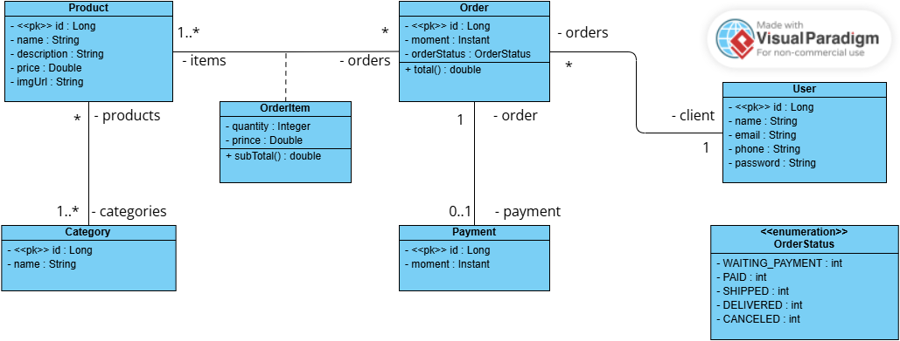

# Web Service com Spring Boot, JPA e PostgreSQL

[](https://www.oracle.com/java/)
[](https://spring.io/projects/spring-boot)
[](https://www.postgresql.org/)
[](https://maven.apache.org/)

## Sobre o Projeto
Este projeto foi desenvolvido durante o curso de **Java e Programação Orientada a Objetos** do Professor Nélio Alves. 

Trata-se de um sistema de back-end que simula o domínio de um e-commerce, aplicando boas práticas de desenvolvimento com Spring Boot, mapeamento objeto-relacional e persistência de dados em base de dados real, incluindo:

- **Arquitetura em Camadas** (Resource, Service, Repository).
- **Persistência em banco de dados real** Configurado para rodar com **PostgreSQL** em ambiente de desenvolvimento/produção.
- **Ambiente de Teste** Suporte para banco de dados em memória **H2** para testes rápidos.
- **Tratamento de Exceções** Implementação de handlers customizados para erros de integridade e recursos não encontrados (404).
- **Seeding de Dados** Povoamento automático da base de dados para facilitar testes.

## Tecnologias Utilizadas
- **Java 17**
- **Spring Boot 3**
- **Spring Data JPA / Hibernate**
- **PostgreSQL** (Base de dados principal)
- **H2 Database** (Base de dados de teste)
- **Maven**

## Modelo de Domínio


## Pré-requisitos

Para rodar este projeto, você precisará ter instalado em sua máquina:

- Java JDK 17 ou superior  
- Maven 3.8 ou superior  
- Uma IDE (IntelliJ IDEA, Eclipse ou VS Code)  

---

## Modo Rápido (H2 - sem configuração)

Ideal para testes rápidos, sem necessidade de banco externo.

### 1. Clone o repositório
```bash
git clone https://github.com/phaeljf/workshop-springboot4-jpa.git
```

### 2. Acesse o diretório
```bash
cd workshop-springboot4-jpa
```

### 3. Execute a aplicação
```bash
./mvnw spring-boot:run
```

### 4. Acesse
- API: http://localhost:8080  
- H2 Console: http://localhost:8080/h2-console  

**Configuração do H2:**
- JDBC URL: `jdbc:h2:mem:testdb`  
- User: `sa`  
- Password: *(vazio)*  

---

## Modo Completo (PostgreSQL)

Para rodar com banco de dados real.

### 1. Criar banco de dados
```sql
CREATE DATABASE springboot_course;
```

### 2. Configurar o arquivo `application-dev.properties`
```properties
spring.datasource.url=jdbc:postgresql://localhost:5432/springboot_course
spring.datasource.username=postgres
spring.datasource.password=123

spring.jpa.hibernate.ddl-auto=update
spring.jpa.show-sql=true
```

### 3. Executar com perfil `dev`
```bash
./mvnw spring-boot:run -Dspring-boot.run.profiles=dev
```

---

## Instruções de Uso

Com a aplicação rodando, você pode testar os endpoints através do navegador ou ferramentas como **Postman** ou **Insomnia**.

A API estará disponível em:
```
http://localhost:8080
```

### Endpoints principais:

- **GET /users** → Lista usuários  
- **GET /users/{id}** → Busca usuário por ID  
- **GET /orders** → Lista pedidos  
- **GET /products** → Lista produtos  
- **GET /categories** → Lista categorias  

---

## Teste rápido

```bash
curl http://localhost:8080/users
```

Se retornar JSON → aplicação funcionando corretamente ✅

---

## Problemas comuns

- Porta 8080 em uso  
  → Configure outra porta em `server.port`

- Erro ao conectar no PostgreSQL  
  → Verifique usuário, senha e se o banco está ativo

- Dependências não resolvidas  
  → Execute: `./mvnw clean install`


---

## Autor

Desenvolvido por **Raphael de Lemos Pires**.

* **GitHub:** [@phaeljf](https://github.com/phaeljf)
* **LinkedIn:** [https://www.linkedin.com/in/raphaellpires/]

---

## Licença

Este projeto foi desenvolvido para fins de estudo e prática. Sinta-se à vontade para clonar e utilizar como base para seus próprios aprendizados. Sob licença MIT.